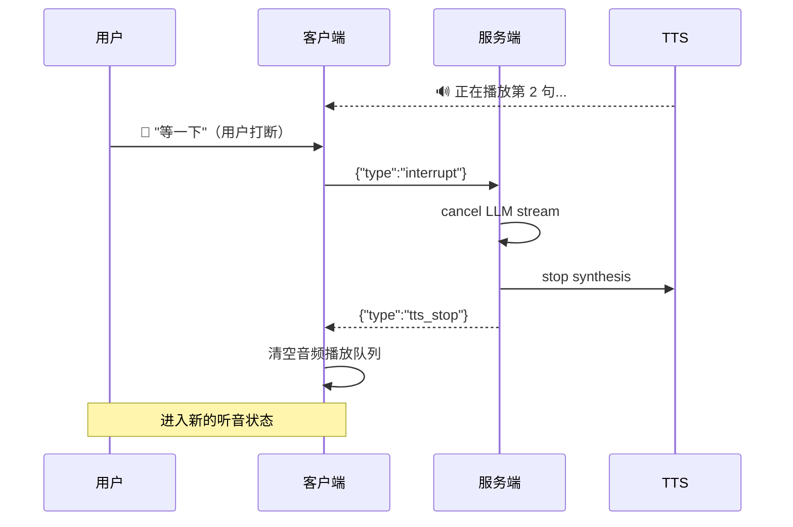

# Sprint 3 · 打断处理与多轮对话

> P22 VoiceAgent · 第 3 周

---

## 目标

实现用户打断（说话时立即停止 TTS）和多轮语音对话上下文管理。

## 任务清单

- [ ] 客户端打断信号（VAD 在 TTS 播放期间检测到语音）
- [ ] 后端取消 LLM 生成 + 停止 TTS
- [ ] 音频播放缓冲管理（打断时清空缓冲）
- [ ] 多轮对话上下文（语音模式记忆）
- [ ] 噪声抑制（避免误触发打断）

## 打断流程



## 核心代码

```java
// 客户端打断检测
public class InterruptDetector {
    private final EnergyVad vad;

    public void onAudioFrame(byte[] frame, boolean isPlaying) {
        if (!isPlaying) return; // 没在播放就不需要检测打断

        VadState state = vad.process(frame, 16000);
        if (state == SPEECH_START) {
            // 检测到用户开始说话 → 打断！
            websocket.send("{\"type\":\"interrupt\"}");
            stopPlayback();
        }
    }
}

// 服务端取消
public class VoiceSessionContext {
    private Future<?> currentFuture;
    private volatile boolean cancelled = false;

    public void cancelGeneration() {
        cancelled = true;
        if (currentFuture != null) {
            currentFuture.cancel(true);
        }
    }

    public boolean isCancelled() { return cancelled; }
}

// Orchestrator 中检查取消
private void synthesizeAndSend(String text, WebSocketSession session, VoiceSessionContext ctx) {
    if (ctx.isCancelled()) return; // 已打断，不再合成
    byte[] audio = ttsClient.synthesize(text, ctx.voiceConfig());
    if (ctx.isCancelled()) return; // 合成期间被取消
    session.sendMessage(new BinaryMessage(ByteBuffer.wrap(audio)));
}
```

## 多轮上下文

```java
// 语音模式与文字模式共享 ChatMemory
// sessionId 关联语音会话和聊天会话
public class VoiceSessionContext {
    String sessionId;          // 与 ChatMemory 的 conversationId 一致
    List<String> utterances;   // 本轮语音对话的转写历史

    // 每轮结束后，LLM 已经通过 ChatMemory 记住了上下文
    // 下次 ASR 转写完成后直接用同一 sessionId 调用 LLM 即可
}
```

## 验收

- [ ] TTS 播放期间用户说话能触发打断
- [ ] 打断后 200ms 内停止音频播放
- [ ] 打断后能正常进入新的听音周期
- [ ] 多轮语音对话有上下文（Agent 记住之前说过的话）
- [ ] 环境噪声不会误触发打断（VAD 阈值合理）
