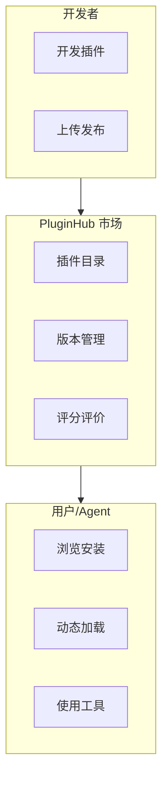

# P23 · Agent 插件生态平台（PluginHub）

> 难度：⭐⭐⭐⭐ · 预计：4 周（4 个 Sprint）

---

## 项目定位

构建一个 Agent 插件市场平台——开发者发布插件，用户安装插件，Agent 动态加载插件。

## Sprint 规划

| Sprint | 目标 |
|--------|------|
| Sprint 1 | 插件 SPI 规范 + 加载引擎 |
| Sprint 2 | 插件市场（发布/浏览/安装） |
| Sprint 3 | 沙箱隔离 + 权限控制 |
| Sprint 4 | 版本管理 + 评分评价 + 推荐 |

## 学习收获

- Java SPI + ClassLoader 隔离
- 插件生命周期管理
- 沙箱安全设计
- 市场平台架构
