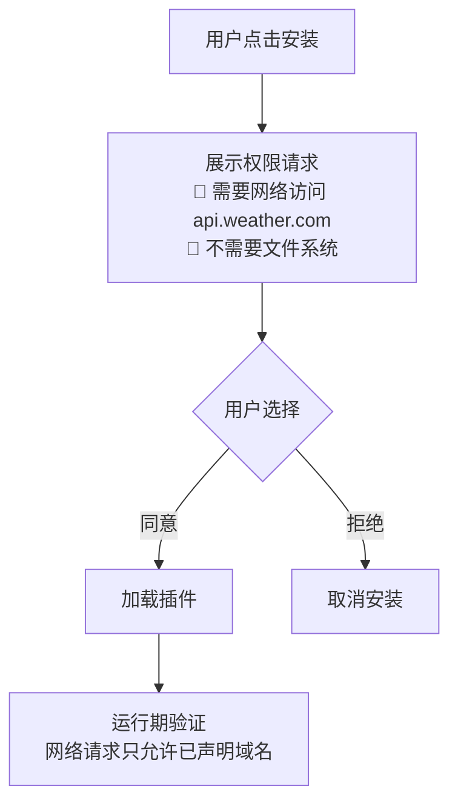

# Sprint 3 · 沙箱隔离与权限控制

> P23 PluginHub · 第 3 周

---

## 目标

实现插件沙箱——限制插件的资源使用、网络访问、执行超时。

## 任务清单

- [ ] 权限审核（网络/文件/环境变量）
- [ ] 执行超时（30 秒上限）
- [ ] 线程池隔离（每插件独立线程池）
- [ ] 网络白名单（只允许声明域名）
- [ ] 安装确认（用户看到权限请求）

## 权限确认流程



## 沙箱执行

```java
@Component
public class PluginSandbox {

    // 每个插件独立线程池（限制并发 + 隔离故障）
    private final Map<String, ExecutorService> pluginPools = new ConcurrentHashMap<>();

    public String executeTool(String pluginId, ToolDefinition tool, String args) {
        ExecutorService pool = pluginPools.computeIfAbsent(pluginId,
            k -> Executors.newSingleThreadExecutor(r -> {
                Thread t = new Thread(r, "plugin-" + pluginId);
                t.setDaemon(true);
                return t;
            }));

        Future<String> future = pool.submit(() -> {
            // 设置 SecurityContext（限制文件/网络）
            return doExecute(pluginId, tool, args);
        });

        try {
            return future.get(30, TimeUnit.SECONDS); // 超时保护
        } catch (TimeoutException e) {
            future.cancel(true);
            return "{\"error\":\"工具执行超时\"}";
        }
    }
}
```

## 验收

- [ ] 插件安装时展示权限请求
- [ ] 插件工具执行有 30 秒超时保护
- [ ] 插件崩溃不影响其他插件和主进程
- [ ] 插件只能访问已声明域名的网络
