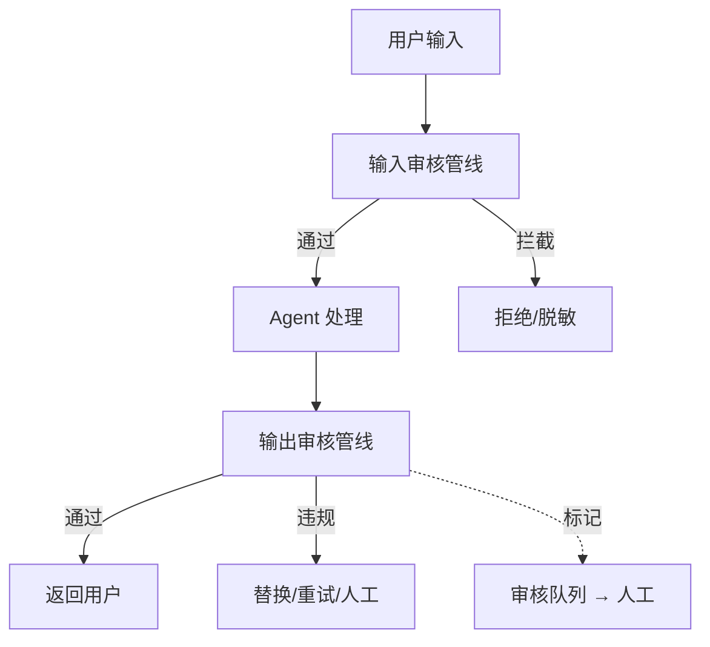

# P24 · Agent 内容安全平台（SafeGuard）

> 难度：⭐⭐⭐⭐ · 预计：4 周（4 个 Sprint）

---

## 项目定位

构建 Agent 专用的内容安全审核平台——输入/输出双向审核、多维度检测、人工审核闭环。

## Sprint 规划

| Sprint | 目标 |
|--------|------|
| Sprint 1 | 审核管线框架 + 正则规则引擎 |
| Sprint 2 | LLM 安全审核 + 越狱检测 |
| Sprint 3 | 幻觉检测 + 密钥泄露检测 |
| Sprint 4 | 人工审核闭环 + 规则自学习 |

## 学习收获

- 内容审核管线设计
- 多维度安全检测
- 正则 + LLM 混合审核
- 人工审核工作流
