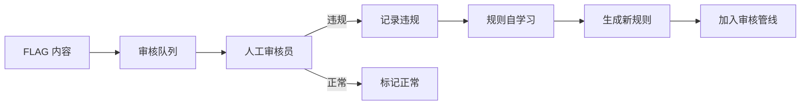

# Sprint 4 · 人工审核闭环与规则自学习

> P24 SafeGuard · 第 4 周

---

## 目标

建立人工审核工作流，实现规则自学习闭环。

## 任务清单

- [ ] 审核队列（FLAG 内容自动入队）
- [ ] 人工审核界面（查看/判定/标注）
- [ ] 审核结果反馈（违规 → 补充规则）
- [ ] 规则自动生成（从审核案例提取模式）
- [ ] 审核效率看板（队列深度/处理时长/准确率）

## 审核工作流



## 核心 API

```java
@RestController
@RequestMapping("/api/review")
public class ReviewController {

    // 领取待审核项
    @GetMapping("/next")
    public ReviewItem next() {
        return reviewQueue.poll();
    }

    // 提交审核结果
    @PostMapping("/{itemId}/decide")
    public void decide(@PathVariable String itemId,
                       @RequestParam boolean violation,
                       @RequestParam(required = false) String category,
                       @RequestParam(required = false) String note) {
        reviewService.decide(itemId, violation, category, note);
        if (violation) {
            // 自动从案例生成新规则
            ruleLearner.learn(itemId, category);
        }
    }

    // 看板
    @GetMapping("/dashboard")
    public ReviewDashboard dashboard() {
        return new ReviewDashboard(
            reviewQueue.size(),       // 队列深度
            avgReviewTimeMinutes(),   // 平均处理时长
            accuracyRate(),           // 审核准确率
            topCategories()           // 热门违规类型
        );
    }
}
```

## 规则自学习

```java
@Component
public class RuleLearner {
    /**
     * 从违规案例中提取模式
     */
    public void learn(String itemId, String category) {
        ReviewItem item = reviewQueue.get(itemId);
        String content = item.content();

        // 用 LLM 提取违规特征模式
        String pattern = llmClient.chat("""
            分析以下违规内容（%s 类型），提取可以用于自动检测的正则或关键词模式。
            内容：%s
            返回 JSON：{"pattern":"...","type":"regex|keyword","description":"..."}
            """.formatted(category, content));

        // 加入候选规则（需人工确认后激活）
        ruleCandidateRepo.save(new RuleCandidate(pattern, category, itemId, false));
    }
}
```

## 验收

- [ ] FLAG 内容自动进入审核队列
- [ ] 审核员能查看内容并判定违规/正常
- [ ] 违规案例能自动提取候选规则
- [ ] 候选规则经确认后加入审核管线
- [ ] 看板展示审核效率和准确率
