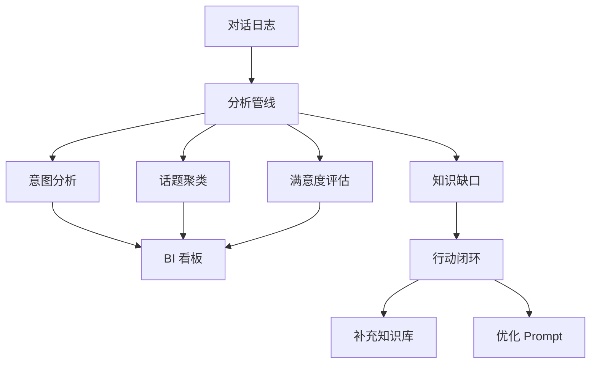

# P25 · Agent 对话分析与 BI 平台（ConversationBI）

> 难度：⭐⭐⭐⭐ · 预计：4 周（4 个 Sprint）

---

## 项目定位

构建 Agent 对话分析平台——从海量对话日志中挖掘用户意图、满意度、商业洞察，驱动持续优化。

## Sprint 规划

| Sprint | 目标 |
|--------|------|
| Sprint 1 | 数据采集 + 清洗去敏 |
| Sprint 2 | 意图分类 + 话题聚类 |
| Sprint 3 | 满意度评估 + 指标体系 |
| Sprint 4 | BI 看板 + 行动闭环 |

## 学习收获

- 对话数据管线设计
- LLM 辅助意图分类和聚类
- 满意度综合评估模型
- 数据驱动决策闭环
