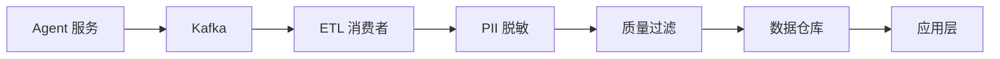

# Sprint 1 · 数据采集与清洗去敏

> P25 ConversationBI · 第 1 周

---

## 目标

建立对话数据采集管线，实现 PII 自动脱敏。

## 任务清单

- [ ] 结构化对话日志模型
- [ ] Kafka 实时采集管道
- [ ] PII 自动脱敏（手机号/身份证/邮箱/地址）
- [ ] 数据质量过滤（空对话/超短对话/测试数据）
- [ ] 数据仓库分层（ODS → DWD → DWS → ADS）

## 数据管线



## 脱敏处理

```java
@Component
public class ConversationEtlConsumer {

    @KafkaListener(topics = "conversation-completed")
    public void process(ConversationLog log) {
        // 1. PII 脱敏
        ConversationLog sanitized = sanitize(log);

        // 2. 质量过滤
        if (isLowQuality(sanitized)) return;

        // 3. 写入数据仓库
        dwWriter.write(sanitized);
    }

    private ConversationLog sanitize(ConversationLog log) {
        return log.mapTurns(turn -> turn.withUserMessage(
            PiiSanitizer.sanitize(turn.userMessage())
            // "我的手机是13912345678" → "我的手机是139****5678"
        ));
    }
}
```

## 验收

- [ ] 对话日志实时流入数据仓库
- [ ] 手机号/身份证/邮箱自动脱敏
- [ ] 空对话和测试数据被过滤
- [ ] 脱敏后数据不可逆
