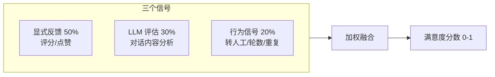

# Sprint 3 · 满意度评估与指标体系

> P25 ConversationBI · 第 3 周

---

## 目标

综合显式反馈 + LLM 隐式评估 + 行为信号，构建对话满意度评分模型。

## 任务清单

- [ ] 显式反馈采集（用户评分/点赞）
- [ ] LLM 隐式满意度评估
- [ ] 行为信号分析（转人工/放弃/重复提问）
- [ ] 综合评分模型（加权融合）
- [ ] 指标体系（效率/质量/成本/业务）

## 评分模型



## 指标看板

```java
@Component
public class MetricsCalculator {
    public DailyReport calculate(LocalDate date) {
        var convs = repository.findByDate(date);
        return new DailyReport(
            convs.size(),
            resolveRate(convs),           // 解决率
            avgSatisfaction(convs),       // 平均满意度
            escalationRate(convs),        // 转人工率
            avgTurns(convs),              // 平均轮数
            avgCost(convs),               // 平均成本
            totalCost(convs),             // 总成本
            intentDistribution(convs),    // 意图分布
            knowledgeGaps(convs),         // 知识缺口
            uniqueUsers(convs)            // 独立用户
        );
    }
}
```

## 验收

- [ ] 每条对话有满意度评分（0-1）
- [ ] 日报包含效率/质量/成本/业务四大维度
- [ ] 能识别低满意度对话的共性原因
- [ ] 知识缺口能自动列出
