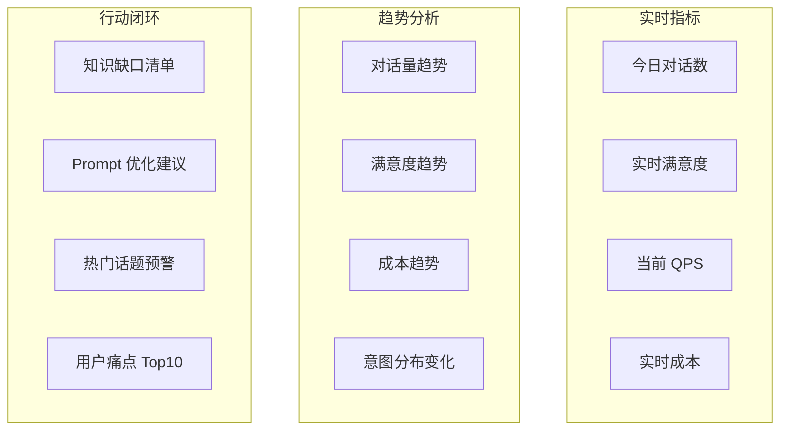

# Sprint 4 · BI 看板与行动闭环

> P25 ConversationBI · 第 4 周

---

## 目标

构建可视化 BI 看板，建立数据驱动的行动闭环。

## 任务清单

- [ ] 实时看板（QPS/延迟/满意度/成本）
- [ ] 趋势分析（日/周/月）
- [ ] 意图分布可视化
- [ ] 知识缺口 → 知识库团队反馈
- [ ] 低满意度对话 → Prompt 优化建议
- [ ] 定期报告自动生成

## 看板布局



## 行动闭环 API

```java
@RestController
@RequestMapping("/api/bi")
public class BiController {

    @GetMapping("/realtime")
    public RealtimeMetrics realtime() {
        return metricsService.realtime();
    }

    @GetMapping("/trend")
    public TrendReport trend(@RequestParam String metric,
                             @RequestParam(defaultValue = "7d") String range) {
        return metricsService.trend(metric, range);
    }

    @GetMapping("/knowledge-gaps")
    public List<KnowledgeGap> gaps() {
        return analyticsService.identifyGaps();
    }

    @GetMapping("/optimization-suggestions")
    public List<OptimizationSuggestion> suggestions() {
        return analyticsService.suggestions();
    }

    @GetMapping("/report/daily")
    public DailyReport dailyReport(@RequestParam(required = false) String date) {
        return reportService.generateDaily(date != null ? LocalDate.parse(date) : LocalDate.now());
    }
}
```

## 验收

- [ ] 实时看板展示核心指标
- [ ] 趋势图支持日/周/月切换
- [ ] 意图分布有饼图可视化
- [ ] 知识缺口清单能导出
- [ ] 能自动生成日报
